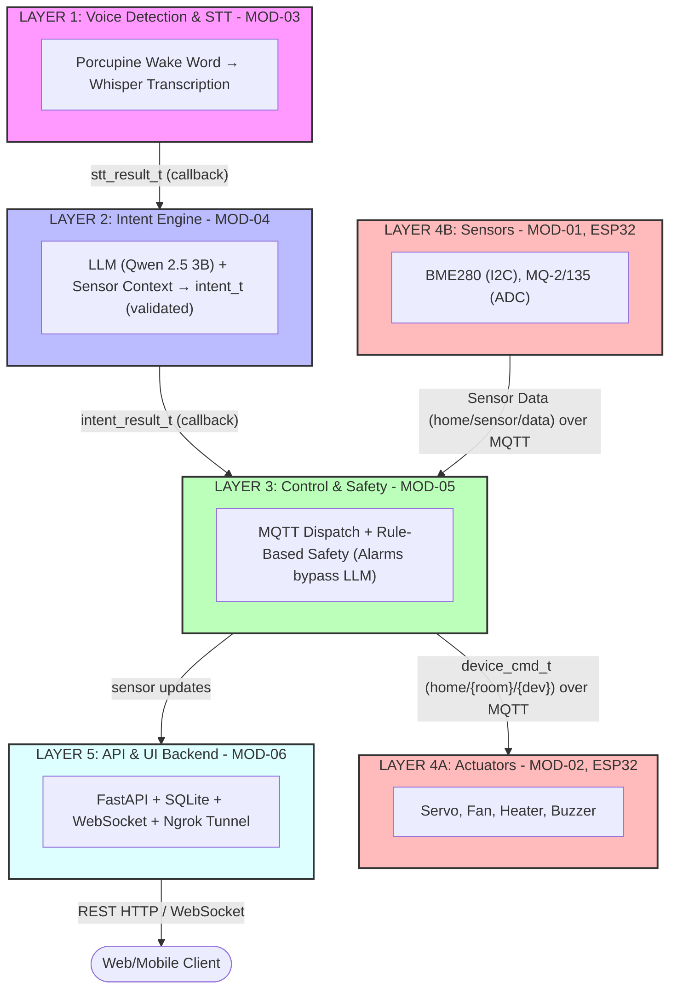
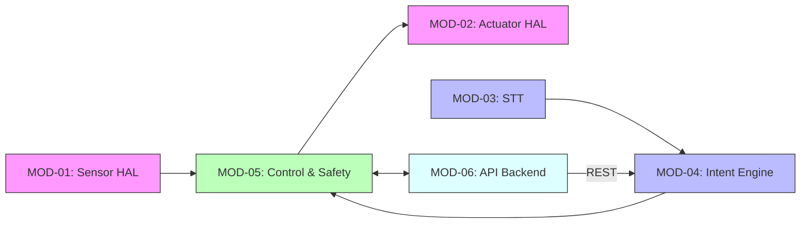

# CSE 396 Computer Engineering Project — Assignment 2

**Project Name:** Natural Language-Based Smart Home Automation System with Modular Architecture  
**Date:** March 28, 2026  

## Cover Page

- **Course name:** CSE 396  
- **Assignment:** 2  
- **Project name:** Natural Language-Based Smart Home Automation System with Modular Architecture  
- **Date:** March 28, 2026  
- **Team Members:**  
  - Emirhan Çalışkan (ID: 220104004955)
  - Burak Kurtaran (ID: 210104004240)
  - Ahmet Burak Çelebi (ID: 220104004885)
  - Dilara Gözen (ID: 230104004065)
  - Taha Emirhan İdeş (ID: 240104004995)
  - Yunus Emre Manav (ID: 210104004024)
  - Zeynep Sude Turan (ID: 220104004031)
  - Mehmet Akif Pekşen (ID: 230104004013)  

## Module–Student Assignment Table

| Module | Module Name             | Responsible Students                                                   | Platform         | Description                 |
| ------ | ----------------------- | ---------------------------------------------------------------------- | ---------------- | --------------------------- |
| MOD-01 | ESP32 Sensor HAL        | Emirhan Çalışkan, Akif Pekşen                                          | C++ / ESP32      | BME280, MCP3008 reading     |
| MOD-02 | ESP32 Actuator HAL      | Emirhan Çalışkan, Akif Pekşen, Dilara Gözen                            | C++ / ESP32      | Servo, fan, relay control   |
| MOD-03 | Audio & STT Pipeline    | Taha Emirhan İldeş, Yunus Emre Manav, Zeynep Sude Turan | Python / RPi     | Porcupine + Whisper         |
| MOD-04 | LLM Intent Engine       | Taha Emirhan İldeş, Yunus Emre Manav, Ahmet Burak Çelebi| Python / RPi     | Qwen 2.5 3B Ollama          |
| MOD-05 | Device Control & Safety | Burak Kurtaran, Ahmet Burak Çelebi                                     | Python / RPi     | MQTT dispatch, safety rules |
| MOD-06 | API Server & UI Backend | Dilara Gözen, Zeynep Sude Turan, Burak Kurtaran                      | Python / FastAPI | REST + WebSocket            |

## System Architecture Diagram

## Module Overview

### MOD-01: ESP32 Sensor HAL
Reads temperature/humidity via BME280 (I2C: GPIO 21 SDA, GPIO 22 SCL) and gas/smoke sensors via MCP3008 SPI ADC (GPIO 5 CS, GPIO 23 MOSI, GPIO 19 MISO, GPIO 18 CLK); publishes readings periodically to MQTT topic `home/sensor/data`.

### MOD-02: ESP32 Actuator HAL
Receives device_cmd_t commands over MQTT on topic `home/{room}/{device}/cmd`; controls servo (SG90 PWM, GPIO 12), DC fan (PWM+MOSFET, GPIO 13), PTC heater (relay, GPIO 14), ultrasonic humidifier (relay, GPIO 15), and buzzer (PWM, GPIO 16).

### MOD-03: Audio & STT Pipeline
Monitors USB/I2S microphone input; detects wake word via Porcupine; converts Turkish speech to text via Whisper base model.

### MOD-04: LLM Intent Engine
Receives STT output + instantaneous sensor snapshot + active user profile; sends few-shot prompt to Qwen 2.5 3B (4-bit quantized, Ollama); produces Pydantic-validated intent_t JSON.

### MOD-05: Device Control & Safety Layer
Converts intent_t from MOD-04 to device_cmd_t list; dispatches via MQTT topic `home/{room}/{device}/cmd` to ESP32 units; subscribes to `home/sensor/data` and `home/sensor/alarm` for safety monitoring; applies rule-based alert actions, bypassing LLM during critical sensor alarms (temperature >40°C, humidity >80%).

### MOD-06: API Server & UI Backend
Provides REST API and WebSocket endpoints; manages user profiles and command logs in SQLite; enables remote access via Ngrok tunnel; broadcasts real-time sensor data to client applications (web/mobile).

## Hardware & Platform Summary

**Central Unit:**
- Raspberry Pi 4 (4GB RAM, ARM Cortex-A72, 1.5 GHz)

**Remote Control Modules (×2):**
- ESP32 (240 MHz CPU, 520 KB SRAM, built-in Wi-Fi 2.4 GHz)

**Sensors:**
- BME280 (I2C @ GPIO 21 SDA / GPIO 22 SCL, addr 0x76): Temperature (–40 to +85°C), humidity (0-100%), pressure (300-1100 hPa)
- MQ-2 (analog via MCP3008 SPI @ GPIO 5 CS / 23 MOSI / 19 MISO / 18 CLK): Gas/smoke detection (0-10000 ppm range)
- MQ-135 (analog via MCP3008): Air quality (CO, benzene, alcohol, NH3)
- Microphone: USB or I2S HAT (Raspberry Pi)

**Actuators:**
- Servo Motor SG90 (PWM @ GPIO 12, ESP32): Curtain control (0–180°)
- DC Fan (PWM @ GPIO 13 + MOSFET, ESP32): Ventilation control (0-100%)
- PTC Heater (relay @ GPIO 14, ESP32): Low-voltage heating
- Ultrasonic Humidifier (relay @ GPIO 15, ESP32): Humidity regulation
- Passive Buzzer (PWM @ GPIO 16, ESP32): Audible alarm (0-5 kHz)

**Communication Buses:**
- I2C: BME280 sensor interface
- SPI: MCP3008 ADC interface (analog sensors)
- MQTT: Inter-module communication over local Wi-Fi
- WiFi (2.4 GHz): ESP32 ↔ Raspberry Pi connectivity
- REST / WebSocket: Client application communication
- Ngrok: Remote tunnel for external access

## Inter-Module Communication Table

| From   | To     | Data                 | Type                      | Direction | Channel                    | Frequency               |
| ------ | ------ | -------------------- | ------------------------- | --------- | -------------------------- | ----------------------- |
| MOD-01 | MOD-05 | `sensor_snapshot_t`  | JSON via MQTT             | 01→05     | `home/sensor/data`         | 5 seconds               |
| MOD-01 | MOD-05 | `sensor_alarm_t`     | JSON via MQTT             | 01→05     | `home/sensor/alarm`        | When threshold exceeded |
| MOD-03 | MOD-04 | `stt_result_t`       | Struct via callback       | 03→04     | In-process Python call     | After each wake word    |
| MOD-04 | MOD-05 | `intent_result_t`    | Struct via callback       | 04→05     | In-process Python call     | After each command      |
| MOD-05 | MOD-02 | `device_cmd_t`       | JSON via MQTT             | 05→02     | `home/{room}/{device}/cmd` | Per intent              |
| MOD-02 | MOD-05 | `actuator_state_t`   | JSON via MQTT             | 02→05     | `home/actuator/status`     | After each command      |
| MOD-06 | MOD-04 | `text_cmd_request_t` | REST POST → function call | 06→04     | FastAPI HTTP handler       | Per user command        |
| MOD-06 | MOD-05 | `user_profile_t`     | Direct function call      | 06→05     | In-process                 | On profile recall       |
| MOD-05 | MOD-06 | `sensor_snapshot_t`  | WebSocket broadcast       | 05→06     | WS push                    | 1 second                |

## Module Dependency Graph

**Dependency Note:** MOD-01 and MOD-02 are independent; MOD-03 feeds into MOD-04; MOD-04 → MOD-05; MOD-05 ↔ MOD-06 (bidirectional for sensor data and profile management).

## Known Risks & Open Questions

| Risk / Question                   | Impact                                            | Mitigation Strategy                                                                  |
| --------------------------------- | ------------------------------------------------- | ------------------------------------------------------------------------------------ |
| **RAM & CPU Bottleneck** (Critical) | Whisper (STT) + Qwen 2.5 3B (LLM) both demand ~3-4GB RAM on Pi 4; concurrent execution risks OOM crash | Use model offloading (load/unload sequentially); monitor RAM via `free -h`; implement process priority; consider heap profiling |
| **Safety Layer Latency**          | If Pi locked in LLM inference, gas/smoke alarm may delay >1s | Implement critical safety checks at edge (ESP32); bypass LLM on alarm; use separate thread for safety |
| **LLM Inference Latency**         | May exceed 10s target on Pi 4                     | Use Qwen 2.5 3B quantized; optimize prompt; consider response caching                |
| **MQTT Broker Reliability**       | Loss of commands/sensor data if Mosquitto crashes | Implement automatic restart script; use QoS 1 messages; add watchdog timer           |
| **STT Wake Word False Positives** | Expensive CPU/memory cycles wasted                | Tune Porcupine sensitivity; test with background noise; implement cooldown timer     |
| **Synchronization Issues**        | Race conditions between MOD-03/04/05              | Use in-process callbacks instead of shared memory; add mutexes where needed          |
| **Hardware Procurement**          | ESP32 / Pi shortages or delays                    | Reserve hardware early; identify replacements (e.g., STM32H7 for ESP32)              |
| **Python ↔ C Header Mismatch**    | Implementers may deviate from interface spec      | Add validation tests; require header-to-code traceability in reviews                 |
| **Remote Access Ngrok Limits**    | Ngrok free tier has bandwidth/connection limits   | Document Ngrok plan in README; plan for potential upgrade or alternative (Cloudflare Tunnel) |
| **SQLite Concurrency**            | Database locks under high command velocity        | Use connection pooling; consider moving to PostgreSQL if needed                      |